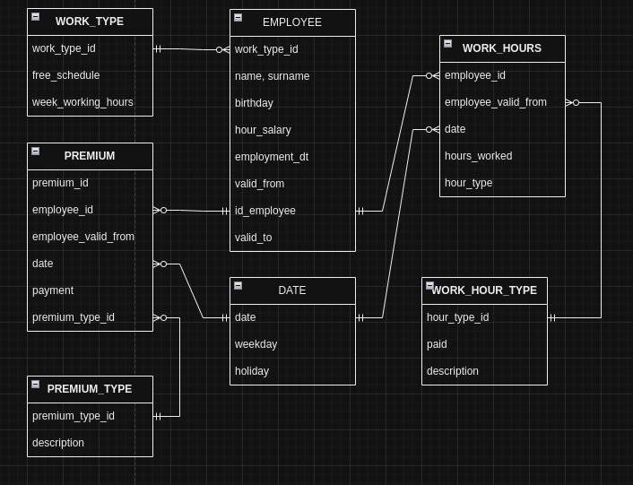

# Проект по базам данных: учет рабочего времени сотрудников
## Описание проекта:
* Cоздание базы данных для учета рабочего времени сотрудников фирмы N.\
Проект представляет из себя получение информации о работе сотрудника каждый день, также выплаты и время его работы.\ Поддерживается возможность изменения данных в таблицах, для этого созданы скрипты, а также всевозможные запросы получения статистики по проекту.\
Учет премий расходов компании, а также ведение статистики по компании.
* Скрипты для создания database и  лежат в файлах script\ddl.sql, script\insert.sql
* Скрипты для получения полезной информации из database лежат в файле script\useful_script.sql с описанием

## Концептуальная модель:

## Логическая модель:

## Таблицы:
- employee - таблица информации о работнике
  - имя
  - фамилия
  - персональный id
  - дата рождения
  - срок валидности пропуска
  - зарплата и какую работу выполняет

- work_type - тип работы, которую выполняет сотрудник
  - тип работы
  - свободный график(да, нет)
  - количество рабочих часов в неделю

- work_hour_type - как происходит работа
  - тип работы
  - оплата за работу
  - описание работы

- work_hours - рабочее время, сколько в эту дату работник отработал и что делал
  - id работника
  - пропуск валиден с/до
  - дата выполнения работы
  - тип выполненной работы
  - количество часов потраченное на работу

- premium - премии работников, описание премий
  - id премии
  - id работника, которому дали премию
  - рабоник устроен с
  - дата выдачи премии
  - сумма премии
  - id описания премии

- premium_type - таблица описания премии
  - id премии
  - описание премии
- date - таблица вспомогательная, для определения разных полезных параметров
  - дата
  - день недели
  - выходной(да/нет)

## Физическая модель:

## Сценарии взаимодействия:
- за счет ссылок одни таблицы будут изменять данные в других
- логические связи между таблицами - установка контроля над сотрудниками и получение полной информации о работе продукта
- связи таблиц:
  - employee with: work_type, work_hours, premium
  - premium with: employee, date, premium_type_id
  - premium_type_id with: premium
  - date with: premium, work_hours
  - work_hours with: employee, date, work_hour_type
  - work_hour_type with: work_hours
  - work_type with: employee

## Точные связи между таблицами:
1) employee основная таблица описывающая работу сотрудников, она имеет связь с типом work_type_id(по должности), а также с рабочими часами по id работника

2) premium - таблица описывающая премию сотрудник, связывается с employee по empolyee_id, а также с premium_type_id по id премии для более детального описания премии

3) work_hours - связана с employee(по empolyee_id) и с work_hour_type(по hour_type_id). Показывает сколько и какую работу выполнял сотрудник с дополнительными параметрами, в виде указания типа дня

4) data - вспомогательная таблица, чтобы соединять employee с work_hours и узнавать дополнительную информацию о дне 
работы(связана по полю data)

5) work_type, work_hour_type, work_premium_type - связаны с соответсвующими таблицами без type, и необходимы для получения описания события, произошедшего в основной таблице(по полю *_type_id)